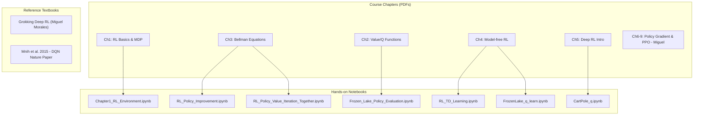
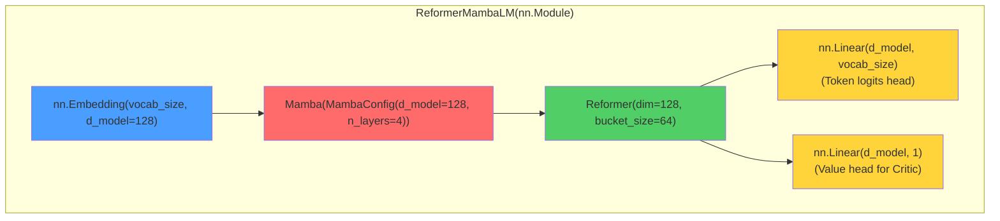

WEBVTT

00:16:05.000 --> 00:16:08.000
Anyone?

00:16:08.000 --> 00:16:15.000
it.

00:16:15.000 --> 00:16:35.000
Good evening, sir.

00:16:35.000 --> 00:16:36.000
Not to hear you, okay.

00:16:36.000 --> 00:17:06.000
So you're not audible.

00:20:20.000 --> 00:20:25.000
We are still not auditing, sir.

00:20:25.000 --> 00:20:55.000
Yes, sir, we are unable to hear you.

00:36:25.000 --> 00:36:29.000
When is that today, no class?

00:36:29.000 --> 00:36:34.000
Ask…

00:36:34.000 --> 00:36:42.000
Oh.

00:36:42.000 --> 00:36:43.000
Yes, that is set.

00:36:43.000 --> 00:36:44.000
Hello? Yeah, hello?

00:36:44.000 --> 00:36:56.000
Yes, sir, we are able to hear you.

00:36:56.000 --> 00:36:57.000
the last class.

00:36:57.000 --> 00:37:12.000
Okay. I'm not sure why it is happening today, because I have been connecting all the time using my… headphone. Now, I just connected… Ah, but… if this is happening randomly, then I… for the next session, this will be a problem for me. Okay, you… today I don't have to teach anything.

00:37:12.000 --> 00:37:18.000
You just, uh, have all of your doubts clear today.

00:37:18.000 --> 00:37:27.000
Regarding the course, okay? Hmm.

00:37:27.000 --> 00:37:37.000
You can ask any question about the… Subject, but not about the question that is going to be coming, okay?

00:37:37.000 --> 00:37:41.000
Sir, how do you suggest we study? Because we started with the book.

00:37:41.000 --> 00:37:42.000
And then we went… so if you could just guide us, like, what will be the best…

00:37:42.000 --> 00:37:46.000
Oh.

00:37:46.000 --> 00:37:53.000
trajectory for study, we can follow that, sir.

00:37:53.000 --> 00:37:54.000
Mmm… let me open my document. Ah.

00:37:54.000 --> 00:38:03.000
I mean, what to do from where, uh, and how much. Sir, once we get into something, no, we go very deep, and then we forget the larger picture, and then this oscillates.

00:38:03.000 --> 00:38:05.000
That's how it's happening for me.

00:38:05.000 --> 00:38:15.000
Yeah, yeah. Okay, so let me share you my screen, what are the chapters I had taught.

00:38:15.000 --> 00:38:28.000
Not getting into exactly in the side chapter, but outline of it.

00:38:28.000 --> 00:38:33.000
Okay, so, uh…

00:38:33.000 --> 00:38:47.000
You focus mostly on, uh, chapter… Uh… 2, 3, 4… 6.

00:38:47.000 --> 00:38:53.000
Chapter 2 is about… That is basic MDP thing.

00:38:53.000 --> 00:39:05.000
Okay. Chapter 2… After 2, 3, 4, and 6.

00:39:05.000 --> 00:39:11.000
This is the… who is basically basic of your reinforcement learning.

00:39:11.000 --> 00:39:26.000
Chapter 3 is about basic MDP.

00:39:26.000 --> 00:39:35.000
Oh. So, uh, chapter 3, 4, uh, 2, 3, 4, and 6.

00:39:35.000 --> 00:39:46.000
We focus mostly on them. And… Regarding the derivation of policy gradient and all, derivation will not be coming as it is.

00:39:46.000 --> 00:40:01.000
However, some little… conceptual trick will be coming, but not to be deriving any kind of… uh… 5-6 lines of all the division, that is not going to be coming like that, okay?

00:40:01.000 --> 00:40:06.000
Okay.

00:40:06.000 --> 00:40:10.000
Yeah, so I'll just tell you briefly about what are the things you must focus on.

00:40:10.000 --> 00:40:15.000
What is the basic Markov decision process, all the properties of them?

00:40:15.000 --> 00:40:25.000
Uh… that is basically involving a Bellman situation. The value function, Q function.

00:40:25.000 --> 00:40:31.000
Policy iteration, value iteration. The Unit 1.

00:40:31.000 --> 00:40:37.000
Then you go into model free, inside model free, you have Monte Carlo, TD Learning.

00:40:37.000 --> 00:40:43.000
And then Q-learning. And deep learning, okay?

00:40:43.000 --> 00:40:48.000
These are the 4 things from the Model 3.

00:40:48.000 --> 00:41:02.000
And then, uh, it is covering almost 80… 90% of the… topics of your questions in the middle… end exam.

00:41:02.000 --> 00:41:13.000
Some conceptual question will be coming in the policy gradient, that's it.

00:41:13.000 --> 00:41:14.000
Okay, sir.

00:41:14.000 --> 00:41:17.000
There is no programming coming in, okay?

00:41:17.000 --> 00:41:22.000
Okay, these are regarding your, um, end semester exam.

00:41:22.000 --> 00:41:28.000
But, do you have anything related to the course itself? Like… Oh.

00:41:28.000 --> 00:41:39.000
What is the screen? So, regarding the course itself, like, what are the concepts that you are still not familiar with?

00:41:39.000 --> 00:41:50.000
That will be useful for your… Like, any kind of use case in your… Normal generative AI things, or any kind of AI things.

00:41:50.000 --> 00:42:02.000
And, uh, clear the doubt. Okay.

00:42:02.000 --> 00:42:10.000
So, have you utilized any kind of… The techniques that you have learned in this course?

00:42:10.000 --> 00:42:15.000
Sir, I read some papers about moral… multi-agent…

00:42:15.000 --> 00:42:16.000
reinforcement learning.

00:42:16.000 --> 00:42:18.000
Ah, Marcus. Mm-hmm.

00:42:18.000 --> 00:42:21.000
So, yeah, I mean, I could relate.

00:42:21.000 --> 00:42:23.000
to a little bit… I mean…

00:42:23.000 --> 00:42:28.000
Of what we studied.

00:42:28.000 --> 00:42:29.000
Uh-huh. Yes, sir.

00:42:29.000 --> 00:42:44.000
But that is very advanced topic. But, uh, whatever has been done in the course, if you have done anything, if you can connect the dots, like, you may not be using them in your, uh… Company's project. But if you have some kind of…

00:42:44.000 --> 00:42:54.000
Connecting the dots, like, which can make sense to your real life requirement.

00:42:54.000 --> 00:43:02.000
If you have not done, not a problem. You… whatever I have taught so far.

00:43:02.000 --> 00:43:18.000
Apart from… Uh, direct use case of… Markov decision process, because they are going to be useful only for, um… only for the robotics case, where the environment knowledge is known to you.

00:43:18.000 --> 00:43:26.000
Apart from them, rest of the… topics are not going to be useful.

00:43:26.000 --> 00:43:36.000
Uh, as far as your… company's project is concerned, somebody, whoever is… Assigned in some kind of projects of LLM.

00:43:36.000 --> 00:43:50.000
Even for them, as a supervised fine-tuning, that stage is… sufficient for them to carry on their project.

00:43:50.000 --> 00:43:58.000
So, you can ask any question which you have heard is required in your utilization of the course knowledge in your.

00:43:58.000 --> 00:44:08.000
In your real life problems that you are dealing in your project.

00:44:08.000 --> 00:44:11.000
So maybe we don't have today, but I'm sure when we…

00:44:11.000 --> 00:44:16.000
For example, even these research papers, when we read, then we can get some…

00:44:16.000 --> 00:44:18.000
Thanks.

00:44:18.000 --> 00:44:21.000
So, we'll have to then, I think, email your…

00:44:21.000 --> 00:44:22.000
Some connect with you.

00:44:22.000 --> 00:44:24.000
Hmm.

00:44:24.000 --> 00:44:26.000
I don't think any of the student…

00:44:26.000 --> 00:44:27.000
is having, because it's a silence.

00:44:27.000 --> 00:44:36.000
Hmm. Hmm. Uh… It is probably not a problem. Multi-agent reinforcement learning is a very advanced topic.

00:44:36.000 --> 00:44:44.000
And, uh… Before that, there is another topic called, uh, deep reinforcement learning.

00:44:44.000 --> 00:44:49.000
Which will go beyond this, uh, policy gradient and PPO.

00:44:49.000 --> 00:44:55.000
Multi-agent reinforcement learning is basically every reinforcement learning agent, they might be having some kind of.

00:44:55.000 --> 00:45:01.000
Knowledge about the environment. Not every agent knows… The similar knowledge.

00:45:01.000 --> 00:45:17.000
So, like, in that environment. How to share the information between them and then take a decision. So it is a com… it is basically useful for… coordinating among the robots.

00:45:17.000 --> 00:45:26.000
And direct use case, I mean, I'm asking about direct use case of the course in your real-life problems that you must think on.

00:45:26.000 --> 00:45:35.000
Those who are working in LLM, even for them also, as I told, up to supervised fine-tuning is going to be sufficient for them.

00:45:35.000 --> 00:45:48.000
Some… some people who are working on, uh, like, model context protocol, like MCP, which is very… Uh, because become a buzzword in the days.

00:45:48.000 --> 00:45:54.000
That is, somebody is using… Some kind of agent PKI.

00:45:54.000 --> 00:46:00.000
To develop… the framework.

00:46:00.000 --> 00:46:07.000
In that case, it is required. For that also, this reinforcement learning will be required.

00:46:07.000 --> 00:46:11.000
Sir, and this moral concept, which you talked about, physical robots, that also is applicable in agentic, uh, multi-agent

00:46:11.000 --> 00:46:16.000
Oh.

00:46:16.000 --> 00:46:17.000
orchestration, right? By sharing

00:46:17.000 --> 00:46:18.000
Oh.

00:46:18.000 --> 00:46:24.000
some cons… I mean, we're sharing the same memory buffer or things like that, to…

00:46:24.000 --> 00:46:25.000
for the environment.

00:46:25.000 --> 00:46:26.000
State.

00:46:26.000 --> 00:46:28.000
Mm-hmm. Ma'am, what do you may not be shared.

00:46:28.000 --> 00:46:30.000
Uh-huh.

00:46:30.000 --> 00:46:42.000
Uh, because… Like, you… they will have an identical copy of memory, but they will not share it.

00:46:42.000 --> 00:46:59.000
It is like, suppose you are sharing the memory, what will happen? The problem is… Who is going to access that particular zone of the memory? That is going to be a… Single point of decision. So again, in that case, it will break the property of.

00:46:59.000 --> 00:47:14.000
Uh, distributed system. So, they may have identical copy of memory, which they will update after regular interval.

00:47:14.000 --> 00:47:15.000
So how many of you are from, uh, Delhi? Have you guys gone to India AI Summit?

00:47:15.000 --> 00:47:22.000
Uh-huh, sir. Okay.

00:47:22.000 --> 00:47:27.000
Sir, one of our classmates was in the stall. He's there in the stall.

00:47:27.000 --> 00:47:35.000
Oh, good. in which university or in a company?

00:47:35.000 --> 00:47:37.000
So.

00:47:37.000 --> 00:47:41.000
Uh, guys, do you remember? I think he was sharing, sharing something of the Navy, right?

00:47:41.000 --> 00:47:45.000
The poster.

00:47:45.000 --> 00:47:46.000
And, like…

00:47:46.000 --> 00:47:50.000
Those who are in Bangalore also, there is going to be another AI summit, I think.

00:47:50.000 --> 00:47:53.000
Oh, nice.

00:47:53.000 --> 00:47:57.000
Do not submit, but some names they are given.

00:47:57.000 --> 00:48:02.000
That is also going to be happening.

00:48:02.000 --> 00:48:09.000
But those are only demonstrating some of the… Uh, successful test case scenario.

00:48:09.000 --> 00:48:15.000
By attending that, you will not get any internal knowledge about it.

00:48:15.000 --> 00:48:16.000
Yeah.

00:48:16.000 --> 00:48:23.000
Would be only a visitor. How we can have a collaboration with them if you are interested.

00:48:23.000 --> 00:48:30.000
Some… some university demonstrated Chinese products, it seems.

00:48:30.000 --> 00:48:31.000
Yeah.

00:48:31.000 --> 00:48:47.000
Uh, that become a news. What other… what others are doing that has not come out in the media, but… What, uh, that copy-pasting thing they are doing, that became a news?

00:48:47.000 --> 00:48:52.000
So, overall, I will tell you one thing.

00:48:52.000 --> 00:49:06.000
Have you guys done any kind of… Very, very small level of… by your own, uh… And training A is very, very small.

00:49:06.000 --> 00:49:18.000
Something like 4 or 5 lines of… Generation of text by using any kind of transformer architecture.

00:49:18.000 --> 00:49:26.000
Sir, you mean invoking the API or something like that?

00:49:26.000 --> 00:49:27.000
Yeah.

00:49:27.000 --> 00:49:33.000
Uh, either you can invoke Hugging Face API. Or… without that, also, PyTorch has a lot of library by which you can do the same job.

00:49:33.000 --> 00:49:43.000
with the API. I had done. So I had developed something. So with the API I was doing this thing through Google Gemini 4.

00:49:43.000 --> 00:49:45.000
But not with PyTorch.

00:49:45.000 --> 00:49:55.000
Okay. Google Gemini. If you are…

00:49:55.000 --> 00:50:14.000
in on that, then I can show you that.

00:50:14.000 --> 00:50:17.000
Your, uh, my screen is shared, right?

00:50:17.000 --> 00:50:20.000
Yes, sir.

00:50:20.000 --> 00:50:37.000
Okay. I'll just show you some… Little bit of… I'll not tell you about the exact thing, what is happening inside in the coding.

00:50:37.000 --> 00:50:48.000
Just to give you what reinforcement learning can do.

00:50:48.000 --> 00:51:10.000
Over and above. This transformer, the wonderful thing called Transformer.

00:51:10.000 --> 00:51:16.000
So, uh, those who… you have done by using Google Gemini, you have used any kind of Hugging Face?

00:51:16.000 --> 00:51:19.000
APIs are… you have… used.

00:51:19.000 --> 00:51:37.000
I… I tried doing with Hugging Face to… through Mistral, there's another model, but I was not successful in that. It was asking for something, and I could not go past a certain point. But then Gemini's API, you don't need hugging Face. You can directly invoke them.

00:51:37.000 --> 00:51:49.000
Okay. I will show you… From my cloud, uh… Development ID.

00:51:49.000 --> 00:52:19.000
It will take some time to log… get loaded.

00:52:19.000 --> 00:52:39.000
How to rename this? It's showing as…

00:52:39.000 --> 00:53:01.000
Okay, so we can share it again.

00:53:01.000 --> 00:53:09.000
Okay, so here is a sample example. Okay.

00:53:09.000 --> 00:53:14.000
of a project that I am working on. So this is a… Research paper.

00:53:14.000 --> 00:53:20.000
It was published in 2023, okay? This is a research paper.

00:53:20.000 --> 00:53:43.000
I have, uh, made it from PDF to text. Just, this is a normal text, okay? I have… made this conversion and this text, I am… Going to process it, so that I can… uh, type something in my program, and it will complete the sentence.

00:53:43.000 --> 00:53:55.000
Okay, so… Here, I have a PPO-based.

00:53:55.000 --> 00:54:03.000
So, this is my PPO best, uh… So our pipeline is this.

00:54:03.000 --> 00:54:13.000
I'm reading the file line by line. After reading the file, I am sending it to Tokenizer. It's a Hanging phase tokenizer.

00:54:13.000 --> 00:54:35.000
converting them to tokens, and then tokens, um… These tokens I'm giving to my… Language model. This language model is made by… Transformer, latest version of transformer, and… So that is my language model I'm using.

00:54:35.000 --> 00:54:41.000
Okay, so I'm also using Mamba. And then transformer. This is my language model.

00:54:41.000 --> 00:54:51.000
And this language model is also determining a… value of the sentence that you have constructed. Okay?

00:54:51.000 --> 00:55:05.000
So… Just like I have this actor critic network, right? In actor-trutic network, I have an actor which is… driven by policy, I have a critique which is driven by value function.

00:55:05.000 --> 00:55:12.000
So I have trained the language model. Now, that language model, after training, I have frozen it out.

00:55:12.000 --> 00:55:15.000
I have saved it, I have frozen it out.

00:55:15.000 --> 00:55:24.000
After that, I am… Creating a reference model from the same language model, creating a copy of the same language model, okay?

00:55:24.000 --> 00:55:31.000
So, then I will keep on modifying the language model that I have trained just now.

00:55:31.000 --> 00:55:35.000
And I will keep the saved language model in reference model.

00:55:35.000 --> 00:55:47.000
That is a standard technique of PPO. After that, I have PPO training functions, which is last two weeks… the last two classes I have shown you. Exactly same thing I have.

00:55:47.000 --> 00:55:58.000
Implemented here. After that, I am… Uh, for the training, my model that I have.

00:55:58.000 --> 00:56:16.000
Saved as a frozen model. That's frozen model, I'm not training it again back, but I have started from the same model, that is my model itself, okay? So, this is my reference model with which I am going to check every time that after modification of my model, I am not going too far away from my reference model.

00:56:16.000 --> 00:56:26.000
Reference model is basically a previous copy version of the same model, this model itself, okay? This model and reference model.

00:56:26.000 --> 00:56:37.000
In that reference model, I'm not modifying anything. However… This model I am modifying. The weights I am getting modified by the help of PPO.

00:56:37.000 --> 00:56:41.000
Training function. So I have PPO loss, and then I am training.

00:56:41.000 --> 00:57:04.000
My model again, using the PPO loss, okay? So… Now I have… safety. The safe person I am calling at a CPO, reformer model, okay? So, this is PPO enabled model here. And before PPO, I have.

00:57:04.000 --> 00:57:15.000
a basic model. Two models I have saved it out. Once my training is done, then I go to my… Uval function.

00:57:15.000 --> 00:57:20.000
So in the UHL, what I'm going to do, I'm just going to give a prompt.

00:57:20.000 --> 00:57:29.000
This is my prompt. Note that I'm not using any Hugging Face API, I'm just… I have just borrowed only one thing that is called Tokenizer.

00:57:29.000 --> 00:57:34.000
Over and above tokenizer, I have not taken anything.

00:57:34.000 --> 00:57:48.000
So, this is my prompt that I am saying, that we need to… this is a prompt, okay? We need to verify the efficiency of our proposed method. After that, this model will autocomplete the sentence. Okay?

00:57:48.000 --> 00:57:53.000
So, I am just defining my same model, that is my language model.

00:57:53.000 --> 00:58:02.000
Then I am going to load the same language model.

00:58:02.000 --> 00:58:07.000
This, uh… after that, the loading is going to happen.

00:58:07.000 --> 00:58:11.000
The main function. Okay, so in the main function.

00:58:11.000 --> 00:58:18.000
I am asking whether you want to run with… PPO mode… Or not.

00:58:18.000 --> 00:58:27.000
Okay? If you give 0, that means I'm not running with EPO model. I'm going to pick up this.

00:58:27.000 --> 00:58:34.000
Basic model. If I give one, I'm going to pick up… PPO model, okay?

00:58:34.000 --> 00:58:40.000
Just to show you the difference between… A basic transformer model, what can you do?

00:58:40.000 --> 00:58:48.000
And, uh, PPO-enabled transform model. So, I have now loaded it up.

00:58:48.000 --> 00:58:54.000
After loading… I'm giving this generated.

00:58:54.000 --> 00:59:03.000
function. To complete this prompt. Okay? Now…

00:59:03.000 --> 00:59:08.000
I will go to…

00:59:08.000 --> 00:59:15.000
I'll go to terminal mode.

00:59:15.000 --> 00:59:21.000
To get a ton of money.

00:59:21.000 --> 00:59:30.000
Because of sharing my windows are not coming off.

00:59:30.000 --> 00:59:47.000
Okay, so here is my terminal. I will run it. It takes some amount of time.

00:59:47.000 --> 00:59:52.000
So… Python.

00:59:52.000 --> 01:00:04.000
You have an underscore symptoms.

01:00:04.000 --> 01:00:14.000
I give it 0. Okay? When I give zero, it will not use any PPO, it will…

01:00:14.000 --> 01:00:21.000
generated by using…

01:00:21.000 --> 01:00:50.000
Okay, so there's some garbage is coming up.

01:00:50.000 --> 01:00:58.000
Okay, I just need to train it again, because there is some problem in that. I just need to train it again.

01:00:58.000 --> 01:01:10.000
Um, if I go to… screen… It takes some amount of time.

01:01:10.000 --> 01:01:40.000
to train it.

01:02:06.000 --> 01:02:25.000
It will take some amount of time. Okay. Let me take some amount of time. By the time I go back to you.

01:02:25.000 --> 01:02:32.000
So, by the way, if you want to do some kind of training by yourself of this language model.

01:02:32.000 --> 01:02:48.000
You can either go to… Hugging Face. Hugging Face will provide a lot of live ready, by which you don't have to write any attention mechanism, you don't have to write any padding of your lines that you are giving up.

01:02:48.000 --> 01:02:56.000
Okay, so it has started coming. 0?

01:02:56.000 --> 01:03:26.000
So, you can go to this website of…

01:04:10.000 --> 01:04:16.000
Probably in your next semester or you'll get into Realm, right?

01:04:16.000 --> 01:04:17.000
No, sir, next time.

01:04:17.000 --> 01:04:29.000
Or this also, you are going through LLM. Makes sense.

01:04:29.000 --> 01:04:39.000
Let this training goes on, huh?

01:04:39.000 --> 01:04:43.000
The training will take some amount of time. How many epoch I have given?

01:04:43.000 --> 01:05:02.000
any box. Two takes amount of time.

01:05:02.000 --> 01:05:11.000
So, mostly all of these LLM pretend LLM that you are using, you can download their pretrained LLM with their.

01:05:11.000 --> 01:05:24.000
Uh… weights… Okay, but uh… if you want to do fine-tuning further, you can do the same predetermined LLM, add some layers, and then do the fine-tuning.

01:05:24.000 --> 01:05:29.000
But alignment using PPO, that is… daunting task.

01:05:29.000 --> 01:05:42.000
For that, you require some… lot of amount of exposure to these problems.

01:05:42.000 --> 01:05:56.000
I will advise you not to go ahead with any kind of readily available things, like… Oh… Like, Gemini provides many other tools they provide.

01:05:56.000 --> 01:06:10.000
You try to do very, very simple, simple steps by using PyTorch and Hallimpace.

01:06:10.000 --> 01:06:32.000
Only if that is required in your… project in your company, then only you do it. Otherwise, like, uh… while learning from a theoretical perspective, you will not get to see the… Transformation within you.

01:06:32.000 --> 01:06:37.000
You can also go through this ulama, how to use Ollama.

01:06:37.000 --> 01:06:52.000
Because it is an open source language model. Restall are closed source, like ChatGPT, Gemini… Everything is closed source.

01:06:52.000 --> 01:07:02.000
So, what else you want to… Ask to me.

01:07:02.000 --> 01:07:08.000
Have you guys, uh, enjoyed these sports or not?

01:07:08.000 --> 01:07:09.000
Yes, sir.

01:07:09.000 --> 01:07:16.000
Yes, it's difficult, but… Yeah.

01:07:16.000 --> 01:07:25.000
So I have one small question. So in this deep Q learning, there's something called experience replay, right? Could you brief me up about it, sir? I'm having confusion understanding it.

01:07:25.000 --> 01:07:32.000
Hmm.

01:07:32.000 --> 01:07:37.000
Okay, so, uh, in the, uh… Q-learning.

01:07:37.000 --> 01:07:50.000
We are going to update. Our queue function… By the help of a… A maximum value of the queue function available in the next time step.

01:07:50.000 --> 01:08:00.000
Now, there is a situation whenever you are learning, in the next state, what will be the Q function? That value will not be… given to you.

01:08:00.000 --> 01:08:04.000
So, in that case, if you, uh, take any random action.

01:08:04.000 --> 01:08:10.000
In that case, you are going to introduce a lot of noise, because your assumption will not be correct.

01:08:10.000 --> 01:08:17.000
For that, what they do is… whatever updation you are making of your queue table.

01:08:17.000 --> 01:08:27.000
you keep a copy of that. Have it every time, like, every 10 steps of application, you save it here, the product queue table.

01:08:27.000 --> 01:08:32.000
Give it… so you are going to have two keywords, two neural network.

01:08:32.000 --> 01:08:41.000
Okay. One neural network is going to be storing the… just 10-step time before the information of the cube table.

01:08:41.000 --> 01:08:50.000
So that you minimize your noise-based next step action. Actually, this deep learning is a breakthrough.

01:08:50.000 --> 01:08:56.000
Breakthrough paper to solve the problem of Atari game.

01:08:56.000 --> 01:09:01.000
And then ping pong game like computer, uh, ping pong.

01:09:01.000 --> 01:09:05.000
You can have two players, they are playing ping pong among them.

01:09:05.000 --> 01:09:10.000
This computer game also has been solved by using B2 Learning.

01:09:10.000 --> 01:09:20.000
So, what they have said is basically… Since in the real world, you don't have any future knowledge about the next state.

01:09:20.000 --> 01:09:29.000
So, in that case, you are going to make any assumption which is naturally going to be a lot of noise. But our job is to minimize that noise.

01:09:29.000 --> 01:09:35.000
It can be possible to minimize only when you have a previous version of your.

01:09:35.000 --> 01:09:43.000
saved information. So that you take a noisy step, but that will not be too much noisy.

01:09:43.000 --> 01:09:56.000
And… that is a basic philosophy behind it. You may have… Uh, like, you may allow to not to maintain a… Replay buffer memory.

01:09:56.000 --> 01:10:02.000
Okay, in that case, you are going to have a lot of noise, which will increase your training time.

01:10:02.000 --> 01:10:14.000
Like, in our case of… This EPO algorithm, we are not saying it explicitly that it is a replay of our memory, but we are implementing the same thing.

01:10:14.000 --> 01:10:27.000
His name is not there, because we are measuring… How far I am going for my reference model. Just now, I have showed you, like, I have a reference model. That reference model is a copy of my just recently trained model.

01:10:27.000 --> 01:10:36.000
Now, this recently trained model, I am going to further modification. That further modification should not go beyond some.

01:10:36.000 --> 01:10:44.000
Range of… what is called KL dihydrums. That is, that measured by KL divergence. The ultimate philosophy is you should not.

01:10:44.000 --> 01:10:53.000
go too much different. You should be within the same kind of… Action and state action pier.

01:10:53.000 --> 01:10:54.000
That is all.

01:10:54.000 --> 01:10:57.000
Understood, sir. I think it's clear now. Thank you.

01:10:57.000 --> 01:11:08.000
Hmm. See, all of these techniques are actually… Learning from the example.

01:11:08.000 --> 01:11:15.000
Whatever example you are seeing. From them, you are going to learn.

01:11:15.000 --> 01:11:21.000
If the examples are too much different from whatever you have seen it, then you are going to be in trouble.

01:11:21.000 --> 01:11:25.000
Will not make… it will not make any sense to you.

01:11:25.000 --> 01:11:28.000
So, for that, uh, you have to prevent it.

01:11:28.000 --> 01:11:44.000
So all of these prevention mechanism is… Whatever update you are making, that updation is not going too much different from your present model.

01:11:44.000 --> 01:11:51.000
In my, uh, school days. I have been a very bad student.

01:11:51.000 --> 01:11:59.000
I never used to follow the class properly. And there are a lot of complaints against me.

01:11:59.000 --> 01:12:04.000
Guardian call, every… every month wants a guardian call like that.

01:12:04.000 --> 01:12:10.000
So, at some point of time, I realized, no… Something is going bad with me.

01:12:10.000 --> 01:12:16.000
So, what I did, instead of, like, I used to go to my tuition teacher.

01:12:16.000 --> 01:12:21.000
But there also is not following the instruction properly.

01:12:21.000 --> 01:12:27.000
So, at some point of time, when I, like, when I crossed class 8.

01:12:27.000 --> 01:12:38.000
Okay, after class 8 is very crucial year, because 9th and 10th minutes… In Bengal, it is very, very crucial days, okay? In those times.

01:12:38.000 --> 01:12:43.000
So, uh, I started learning from the examples of the book.

01:12:43.000 --> 01:12:47.000
Uh, because my teachers also refused me to teach me.

01:12:47.000 --> 01:12:53.000
Then I started learning from the examples given in the maths book.

01:12:53.000 --> 01:13:03.000
From then, I started doing self-learning. So, like that, actually, real world is also like that.

01:13:03.000 --> 01:13:16.000
Many of you may not be… may not be good at every stage of your life, but most of you have done some excellent thing in your life, in your… some point of time in your life.

01:13:16.000 --> 01:13:27.000
So, whenever you're doing something excellent. That excellence is coming from within you. That means… that is my belief.

01:13:27.000 --> 01:13:36.000
For that, you are learning by yourself. That is why this teaching, whatever I am doing, it may not make any sense to you right now.

01:13:36.000 --> 01:13:48.000
Only when you get into the, uh, problem, where you have to use this… Whatever you are learning, not only my course, whatever course you are learning, you have to make use of those things, then only you will be able to…

01:13:48.000 --> 01:14:02.000
Make any excellent thing.

01:14:02.000 --> 01:14:08.000
When the training is going on, it will take…

01:14:08.000 --> 01:14:19.000
So, the overall architecture remains same, okay? You are going to reuse your… whatever knowledge you have gained by using some kind of either replay memory, or if you are using, in case of.

01:14:19.000 --> 01:14:26.000
PPO algorithm, then you are making a reference model out of the same model that you have trained it out.

01:14:26.000 --> 01:14:32.000
So that whenever you are making any updation, you are not… you're ensuring that you are not going too much updated.

01:14:32.000 --> 01:14:39.000
It is also, like, average case scenario, okay? Suppose, see, all of these learning that you do.

01:14:39.000 --> 01:14:47.000
Okay, the principal… The effect of learning is, if someone is very good.

01:14:47.000 --> 01:14:51.000
We make… we pull them down to become average.

01:14:51.000 --> 01:14:58.000
And if someone is very bad, we try to pull them up to become average.

01:14:58.000 --> 01:15:02.000
That is the main effect of any kind of learning.

01:15:02.000 --> 01:15:08.000
Some of the students may be very good inside the classroom of, let's say, around 60 students.

01:15:08.000 --> 01:15:14.000
Some of the students are very good. For them, it may be repeating whatever I am saying.

01:15:14.000 --> 01:15:18.000
So, in effect, what is happening? I am pulling them down.

01:15:18.000 --> 01:15:22.000
And if some of the students are really very poor condition.

01:15:22.000 --> 01:15:36.000
So, at the end, they have to get past, so we are trying to pull them up. So… The net effect of all this learning is basically… You don't want anyone to become too much updated that he should go beyond our…

01:15:36.000 --> 01:15:41.000
Knowledge base.

01:15:41.000 --> 01:15:48.000
And that is what is happening here also, in this… replay memory and all.

01:15:48.000 --> 01:16:05.000
Okay.

01:16:05.000 --> 01:16:11.000
But I hope whenever you get into some kind of… AI-based project in your job.

01:16:11.000 --> 01:16:35.000
which requires some kind of… Knowledge beyond supervised fine-tuning. In that case, this will be useful for you.

01:16:35.000 --> 01:16:45.000
Now, PPO started training. How much time you have, Phil?

01:16:45.000 --> 01:16:47.000
The 1.45, the next one starts in.

01:16:47.000 --> 01:16:56.000
Actually, I have it the same thing in my Google… My… Let me check out whether I have it here or not.

01:16:56.000 --> 01:17:17.000
One… Google Collab, let me check it out.

01:17:17.000 --> 01:17:33.000
All these agentic AI-based tools, like Claude, which is… uh, becoming… de facto for any coding companies.

01:17:33.000 --> 01:17:40.000
All of them, it is nothing but this… LLM with PPO-based training.

01:17:40.000 --> 01:17:56.000
Which has been trained with only the codes, not by using any English language and all.

01:17:56.000 --> 01:18:26.000
Whether I have it here…

01:18:37.000 --> 01:18:48.000
GPO is taking much longer time in your training. You got… It is bound to take much longer time.

01:18:48.000 --> 01:19:15.000
So, this is the same thing for evaluation. Let me see how sentence has been constructed or not.

01:19:15.000 --> 01:19:45.000
No, it is not having. The sentence has not been fully constructed.

01:19:49.000 --> 01:20:01.000
So this is another version of RLHS. wherein I have taken the help of Hugging Face. Everything is done by Hugging Face.

01:20:01.000 --> 01:20:06.000
I am not… uh, so all of these techniques of defining this.

01:20:06.000 --> 01:20:16.000
architecture of your models, that 3 models you require, one is language model, one is reward model, and then another one is supervised fine-tuning model.

01:20:16.000 --> 01:20:33.000
All of them has been defined by the help of this… Hugging first things, okay? This auto model… For causal LM. Causal LM means causal language model, okay? All of them has been taken from.

01:20:33.000 --> 01:20:51.000
So, for this, I have some kind of output, but again, it is from Hugging Face, so I don't have much… Things to contribute, so here… I will show you that I have a… predefined data set.

01:20:51.000 --> 01:20:59.000
That I am taking from them, from Hugging Face itself. This is the dataset.

01:20:59.000 --> 01:21:10.000
It is 2 meters it…

01:21:10.000 --> 01:21:25.000
So, this is the load dataset I'm using. This is SST data set. This is coming from… Outside lock.

01:21:25.000 --> 01:21:41.000
Okay, training is finished. Johan…

01:21:41.000 --> 01:21:47.000
Know the base. It's a base mode. The base mode, based on the prompt.

01:21:47.000 --> 01:21:54.000
We are going to see the response coming out, okay? So here is the response.

01:21:54.000 --> 01:22:03.000
See the response? Here, okay? My prompt was… What is my prompt?

01:22:03.000 --> 01:22:04.000
I think we need to verify efficiencies.

01:22:04.000 --> 01:22:08.000
Here is the prompt. Uh, the first few… first few words.

01:22:08.000 --> 01:22:14.000
Here is the prompt given. Yeah. Prompt.

01:22:14.000 --> 01:22:28.000
We need to verify. Efficiency of our proposed method, okay? Then the sentence getting completed, not by using PPO, this is a basic model. We need to verify efficiency of our proposed method with the spatial detail estimation.

01:22:28.000 --> 01:22:35.000
Releasing from the burden of reconstructing the whole data, it reduces mapping space.

01:22:35.000 --> 01:22:49.000
So let… again, you take a look properly, I have not taken any Hugging Face model, and this is my custom dataset. All of the codes are written in PyTorch, and only 10 epoch I have trained in front of you, we have seen, right?

01:22:49.000 --> 01:22:53.000
This has no predefined weight that I have loaded up.

01:22:53.000 --> 01:23:03.000
Now, I'm going to run the same thing. Well… using pipe. Using PPO, okay? Python.

01:23:03.000 --> 01:23:13.000
Invent or pi. I'm giving a PPO to be invoked. The moment I give… One argument, the PPO will be coming up.

01:23:13.000 --> 01:23:26.000
Then you will see the difference between their output.

01:23:26.000 --> 01:23:30.000
Okay, now you see the difference between the output.

01:23:30.000 --> 01:23:34.000
The PPO is giving the first line itself, sir.

01:23:34.000 --> 01:23:48.000
Uh, PPO is given like this. We need to verify efficiency proposed method with and without residual learning strategy. Residual learning is a very important learning. It is basically contribution coming from.

01:23:48.000 --> 01:23:58.000
Deep learning paper called residual Network, ResNet, okay? Then, the base values are highlighted in bold face. Conclusion is going, in this work.

01:23:58.000 --> 01:24:07.000
Transformer-based architecture called FIFSOMER is proposed. Okay, so here, look at the… Contextual relation.

01:24:07.000 --> 01:24:15.000
I have given the prompt that we need to… Verify efficiency of our proposed method. Then that's it. After that, it has to autocomplete.

01:24:15.000 --> 01:24:21.000
PPO is doing with a… some kind of intention to the prompt.

01:24:21.000 --> 01:24:25.000
Whatever is given the prompt, it is coming here. Without PPO, what it is saying.

01:24:25.000 --> 01:24:34.000
It is constructing an English sentence properly. So we need to verify efficiency of our proposed method with spatial detail estimation.

01:24:34.000 --> 01:24:45.000
Releasing from burden of reconstructing the whole data. This is a generic sentence, okay? This is not particular property of this paper.

01:24:45.000 --> 01:24:53.000
It reduces the mapping space of proposed network, which enhances final performance.

01:24:53.000 --> 01:25:06.000
various experiments, quality index, so superiority compared with… Okay, so… PPO… does a better job.

01:25:06.000 --> 01:25:11.000
With respect to the context that you have given.

01:25:11.000 --> 01:25:15.000
It's also our method integrates self-attention mechanism that can exploit.

01:25:15.000 --> 01:25:27.000
Global relationship. This is part of the contribution of the proposed method, okay? So… You see that PPO method of producing a sentence which makes a better sense.

01:25:27.000 --> 01:25:31.000
And that is what I wanted to demonstrate to you, okay?

01:25:31.000 --> 01:25:45.000
That is why? Reinforcement learning is making the most important role in today's AI world.

01:25:45.000 --> 01:25:56.000
Without reinforcement learning, you can simply train your. B layers of transformer network. It can do wonderful job.

01:25:56.000 --> 01:26:16.000
Because I have found it too, right? Here is my… How many layers? I don't have much layer here.

01:26:16.000 --> 01:26:21.000
I don't have much layers.

01:26:21.000 --> 01:26:28.000
The number of layers that I'm adding. Only 4 layers I am adding.

01:26:28.000 --> 01:26:38.000
Okay? And I'm getting 14 epochs only. Still, it is able to do some better job.

01:26:38.000 --> 01:26:43.000
For both the case of normal transformer and TPU.

01:26:43.000 --> 01:26:49.000
Okay, so that is what… I wanted to show it to you.

01:26:49.000 --> 01:26:58.000
Anything else you want to ask me?

01:26:58.000 --> 01:27:04.000
Sir, uh, the class notes for the last 3 classes are the link is not yet there.

01:27:04.000 --> 01:27:06.000
We are not able to submit.

01:27:06.000 --> 01:27:09.000
How many? I mean, uh, how many weeks?

01:27:09.000 --> 01:27:19.000
Last trade lesson last 3 classes, excluding this. Quiz wasn't made available, but the class note link is still not there.

01:27:19.000 --> 01:27:21.000
Okay. Last three weeks.

01:27:21.000 --> 01:27:22.000
Yes, sir. Class 3 classes.

01:27:22.000 --> 01:27:26.000
Last three classes are not we.

01:27:26.000 --> 01:27:28.000
It is week-by-week uploading, right? So, how many… how many weeks are lost?

01:27:28.000 --> 01:27:33.000
Yes, sir, that means 2 weeks, uh… 2 weeks, sir.

01:27:33.000 --> 01:27:36.000
2 weeks.

01:27:36.000 --> 01:27:39.000
I think only last week it was not there, no.

01:27:39.000 --> 01:27:41.000
No, last trade losses.

01:27:41.000 --> 01:27:48.000
Uh, the previous wala to be submitted in the same, na? Whatever it was open, that link itself.

01:27:48.000 --> 01:27:51.000
Uh, I think last week also, same problem happened. I mailed them.

01:27:51.000 --> 01:27:54.000
Yeah, but it was not rectified, sir.

01:27:54.000 --> 01:28:00.000
Sir, actually, for, uh, from 4th February, 7th February, 11th February, and 18th February.

01:28:00.000 --> 01:28:01.000
Yeah.

01:28:01.000 --> 01:28:03.000
4th February?

01:28:03.000 --> 01:28:04.000
Today's class notes, it's not required, right?

01:28:04.000 --> 01:28:05.000
7 February. Okay. Then 11th of February, 11th of February.

01:28:05.000 --> 01:28:06.000
Today, classmates is not required, yeah. 4, 7, and 11, yeah, sir.

01:28:06.000 --> 01:28:15.000
Not river, not rigor. 47?

01:28:15.000 --> 01:28:21.000
Okay. Last note on the light. What about the quiz?

01:28:21.000 --> 01:28:23.000
12 quizzes completed, sir.

01:28:23.000 --> 01:28:25.000
Completed, sir.

01:28:25.000 --> 01:28:34.000
Okay, okay. Okay, fine.

01:28:34.000 --> 01:28:37.000
Okay, I have taken note, I'll send a mail to them.

01:28:37.000 --> 01:28:38.000
So, in total, 12 quizzes, or there'll be more?

01:28:38.000 --> 01:28:40.000
Sure, we'll just…

01:28:40.000 --> 01:28:44.000
No, no, 12 only, 12 into 3, 36 marks.

01:28:44.000 --> 01:28:47.000
Okay, sir, got it. So, on today's… today is the last class, right?

01:28:47.000 --> 01:28:51.000
Okay. Ah, to the last one.

01:28:51.000 --> 01:28:55.000
Sir, that one question got rectified, sir?

01:28:55.000 --> 01:29:11.000
Oh, that your, uh, yeah, that was a mistake from our side, so you will get marks for that.

01:29:11.000 --> 01:29:19.000
Okay.

01:29:19.000 --> 01:29:24.000
Anything else?

01:29:24.000 --> 01:29:28.000
Um, that's also, we are good.

01:29:28.000 --> 01:29:36.000
Okay, fine. Okay, so then… We'll close the class today, all the best for your exam and your future course, okay?

01:29:36.000 --> 01:29:38.000
Thank you, sir.

01:29:38.000 --> 01:29:39.000
Thank you, sir.

01:29:39.000 --> 01:29:42.000
Thank you, sir. Thank you.

01:29:42.000 --> 01:29:47.000
Okay.

01:29:47.000 --> 01:29:49.000
With the meeting.

01:29:49.000 --> 01:29:55.000
Thank you


# Visual Extraction Report: RL Course — Doubt-Clearing Session & PPO-Aligned LM Demo

## Metadata
- **Video**: Local Zoom recording `GMT20260218-124559_Recording_1686x768.mp4`
- **Duration**: 1:29:33
- **Instructor**: Dr. Dibyajyoti Guha (IIIT Dharwad)
- **Topic**: RL course recap (exam prep) + live PPO-based language model alignment demo
- **Platform**: Zoom recording with screen share (Lightning.ai IDE, Google Colab, GitHub Gist)
- **Extraction Date**: 2026-02-22
- **Total Visuals Identified**: 15

***

## 1. Visual Index

| ID  | Timestamp | Type | Description | Source | Priority |
|-----|-----------|------|-------------|--------|----------|
| V1 | 00:00–38:00 | Camera only | Instructor + students — verbal Q&A on exam topics (no slides/visuals) | Video | Low |
| V2 | 38:47 | File explorer | **RL_Course folder** — complete course material listing | Video frame [file](file:///Users/pchinnai/Downloads/GMT20260218-124559_Recording_1686x768.mp4) | High |
| V3 | 40:38 | File explorer | Same folder, different sort order, full file list | Video frame | High |
| V4 | 42:30–49:55 | Browser | Zoom Post-Attendee page / Gmail (admin setup, credentials) | Video frame | Low |
| V5 | 51:47 | IDE overview | Lightning.ai IDE — project file tree (THIS_STUDIO) | Video frame | High |
| V6 | 52:42 | IDE overview | File explorer with `data.txt` selected | Video frame | Medium |
| V7 | 53:10 | Text file | **data.txt** — research paper training corpus (Fusormer paper) | Video frame | High |
| V8 | 53:38 | Code | **Config & imports** at top of `train_with_ppo_sentence_fixed.py` | Video frame | High |
| V9 | 53:55 | Code | **DataLoader + Model class definition** (collate_fn, ReformerMambaLM) | Video frame | High |
| V10 | 54:34 | Code | **LM Pretraining loop** (cross-entropy loss, optimizer) | Video frame | High |
| V11 | 55:57 | Code | **PPO Training loop** (actor-critic, reference model, GAE) | Video frame | High |
| V12 | 57:21 | Code | **eval_sentence_fixed.py** — evaluation script with model architecture | Video frame | High |
| V13 | 1:00:08 | Terminal | **Base model (no PPO) output** — garbled/generic text | Video frame | High |
| V14 | 1:04:18 | Code + Terminal | **compute_advantages (GAE)** + LM training loss curve | Video frame | High |
| V15 | 1:05:42 | Code + Terminal | Reference model creation + full LM epoch losses | Video frame | High |
| V16 | 1:07:05 | Reference doc | **GitHub Gist** — LLM tutorial (Dataset, DataLoader, Model Definition) | Video frame | Medium |
| V17 | 1:12:12 | Terminal | **Complete LM loss curve** (epochs 0–7) | Video frame | High |
| V18 | 1:18:41 | Colab notebook | **eval_sentence.ipynb** — top-k sampling generation code | Video frame | Medium |
| V19 | 1:20:05 | Colab notebook | **3-RLHF.ipynb** — GPT2RewardModel class for RLHF | Video frame | High |
| V20 | 1:21:28 | Code | **eval.py** — mode-switching (BASE vs PPO) + base model terminal output | Video frame | High |
| V21 | 1:23:20 | Terminal | **Side-by-side BASE vs PPO output comparison** | Video frame | **Critical** |
| V22 | 1:25:11 | Terminal | **Full PPO model generated text** (Fusormer, residual learning, contributions) | Video frame | **Critical** |

***

## 2. Detailed Visual Reconstructions

***

### V2/V3: RL_Course Folder — Complete Course Materials (~38:47–40:38)

**Source**: Reconstructed from video frame [file](file:///Users/pchinnai/Downloads/GMT20260218-124559_Recording_1686x768.mp4)
**Type**: Markdown Table

The instructor shared their local file explorer showing the course folder at `E:\RL_Course`. This reveals the full course structure (6 PDF chapters, 7+ Jupyter notebooks, 2 reference textbooks).

| # | File Name | Date Modified | Type | Size |
|---|-----------|---------------|------|------|
| 1 | `CartPole_q.ipynb` | 06-01-2026 | Jupyter Notebook | 97 KB |
| 2 | `Chapter1` | 19-11-2025 | PDF | 366 KB |
| 3 | `Chapter1_RL_Environment.ipynb` | 26-11-2025 | Jupyter Notebook | 28 KB |
| 4 | `Chapter2` | 19-11-2025 | PDF | 653 KB |
| 5 | `Chapter3` | 19-11-2025 | PDF | 938 KB |
| 6 | `Chapter4` | 19-11-2025 | PDF | 2,107 KB |
| 7 | `Chapter5` | 19-11-2025 | PDF | 2,047 KB |
| 8 | `Chapter6_9_Miguel` | 09-01-2026 | PDF | 8,602 KB |
| 9 | `RL_Policy_Improvement.ipynb` | 10-12-2025 | Jupyter Notebook | 39 KB |
| 10 | `RL_Policy_Value_Iteration_Together.ipynb` | 16-12-2025 | Jupyter Notebook | 42 KB |
| 11 | `RL_TD_Learning.ipynb` | 21-01-2026 | Jupyter Notebook | 661 KB |
| 12 | `Frozen_Lake_Policy_Evaluation.ipynb` | 06-12-2025 | Jupyter Notebook | 33 KB |
| 13 | `FrozenLake_q_learn.ipynb` | 30-12-2025 | Jupyter Notebook | 15 KB |
| 14 | `Miguel Morales - Grokking Deep Reinfor…` | 07-01-2026 | PDF (Textbook) | 17,742 KB |
| 15 | `MnihEtAlHassabis15NatureControlDeepRL` | 14-01-2026 | PDF (Paper) | 4,296 KB |

**Course-to-Notebook mapping (inferred)**:



***

### V5/V6: Lightning.ai Project File Tree (~51:47–52:42)

**Source**: Reconstructed from video frame [file](file:///Users/pchinnai/Downloads/GMT20260218-124559_Recording_1686x768.mp4)
**Type**: ASCII tree + Markdown Table

**Platform**: Lightning.ai Cloud IDE
**URL**: `lightning.ai/dguhanus/vision-model/studios/marginal-gold-pspx/code`
**Project**: `Dibyajyoti Guha / Vision-model / marginal-gold-pspx`

```
THIS_STUDIO/
├── .lightning_studio/
├── 1.txt
├── ADMIN_CSNet_DI_TPAML_2020…
├── base_reformer_mamba.pt          ← Pre-trained base model checkpoint
├── bpe.model                       ← SentencePiece BPE tokenizer model
├── bpe.vocab                       ← BPE vocabulary file
├── byte_level_bpe_data.tokenizer.j… ← Byte-level BPE tokenizer (JSON)
├── create_bpe.py                   ← Script to create BPE tokenizer
├── data.txt                        ← Training corpus (research paper text)
├── eval_sentence_fixed.py          ← Evaluation script (HuggingFace tokenizer)
├── eval_sentence.py                ← Evaluation script (alternate)
├── eval.py                         ← Evaluation with BASE/PPO mode switch
├── main.ipynb                      ← Main Jupyter notebook
├── main.py                         ← Main Python script
├── mamba_ppo.pt                    ← PPO-trained model checkpoint
├── match.txt
├── old_data.txt
├── ppo_higgsfield_multiplesample…  ← PPO impl (Higgsfield variant)
├── ppo_higgsfield.py               ← PPO impl (Higgsfield)
├── ppo_reformer_mamba.pt           ← PPO-Reformer-Mamba checkpoint
├── test_tokenizer_loader.py
├── tokenizer_code.py
├── train_with_ppo_sentence_fixed.py ← ★ Main training script (fixed)
├── train_with_ppo_sentence.py      ← Training script (original)
├── train_with_ppo.py               ← Training script (alternate)
├── train.py                        ← Basic training script
├── Untitled.ipynb
└── Untitled1.ipynb
```

**Key model checkpoints**:

| Checkpoint File | Description | Role |
|----------------|-------------|------|
| `base_reformer_mamba.pt` | Pre-trained LM (no PPO) | Base model / Reference model |
| `mamba_ppo.pt` | PPO-aligned model | Actor-Critic updated weights |
| `ppo_reformer_mamba.pt` | PPO-Reformer-Mamba variant | Alternate PPO checkpoint |

***

### V8: Hyperparameters & Configuration (~53:38)

**Source**: Video frame — top of `train_with_ppo_sentence_fixed.py`
**Type**: Markdown Table + Code block

```python
# Imports
import torch
import torch.nn as nn
from mamba_ssm.mamba import Mamba, MambaConfig
from reformer_pytorch import Reformer
from transformers import AutoTokenizer
import copy

# Device
device = "cuda" if torch.cuda.is_available() else "cpu"

# Config
seq_len     = 128
bucket_size = 64
batch_size  = 32
d_model     = 128
n_layers    = 4
```

| Parameter | Value | Notes |
|-----------|-------|-------|
| `seq_len` | 128 | Maximum sequence length for tokenizer/model |
| `bucket_size` | 64 | Reformer LSH attention bucket size |
| `batch_size` | 32 | Training batch size |
| `d_model` | 128 | Hidden dimension / embedding size |
| `n_layers` | 4 | Number of Mamba layers |
| `device` | `cuda` / `cpu` | Auto-detected |

***

### V9: ReformerMambaLM Model Architecture (~53:55)

**Source**: Video frame — `train_with_ppo_sentence_fixed.py` lines 26–76+
**Type**: Mermaid architecture diagram + Code pseudocode



**Architecture as pseudocode:**

```
class ReformerMambaLM(nn.Module):
    def __init__(self, vocab_size):
        super().__init__()
        self.embed     = nn.Embedding(vocab_size, d_model)       # Token embeddings
        self.mamba     = Mamba(MambaConfig(d_model, n_layers=4))  # Mamba SSM layers
        self.reformer  = Reformer(dim=d_model, bucket_size=64)   # Reformer attention
        self.head      = nn.Linear(d_model, vocab_size)          # Actor: token logits
        self.value_head= nn.Linear(d_model, 1)                   # Critic: state value

    def forward(self, input_ids):
        x = self.embed(input_ids)   # [B, T] → [B, T, d_model]
        x = self.mamba(x)           # Mamba SSM processing
        x = self.reformer(x)        # Reformer attention
        logits = self.head(x)       # [B, T, vocab_size]
        values = self.value_head(x).squeeze(-1)  # [B, T]
        return logits, values
```

**Data pipeline:**

```python
class LineSentenceDataset(Dataset):
    def __init__(self, filepath):
        # Reads data.txt line by line
        ...

def collate_fn(batch):
    return tokenizer(batch, truncation=True,
                     max_length=seq_len,
                     return_tensors="pt")

loader = DataLoader(text_dataset,
                    batch_size=batch_size,
                    shuffle=True,
                    collate_fn=collate_fn)
```

***

### V10: LM Pretraining Loop (~54:34)

**Source**: Video frame — `train_with_ppo_sentence_fixed.py` lines 105–127
**Type**: Pseudocode

```
Algorithm: Language Model Pretraining
──────────────────────────────────────
Input: loader (DataLoader), model (ReformerMambaLM), optimizer
Output: Pre-trained model weights saved to "base_reformer_mamba.pt"

print("Starting LM pretraining...")

for epoch in range(10):
    for batch in loader:
        input_
